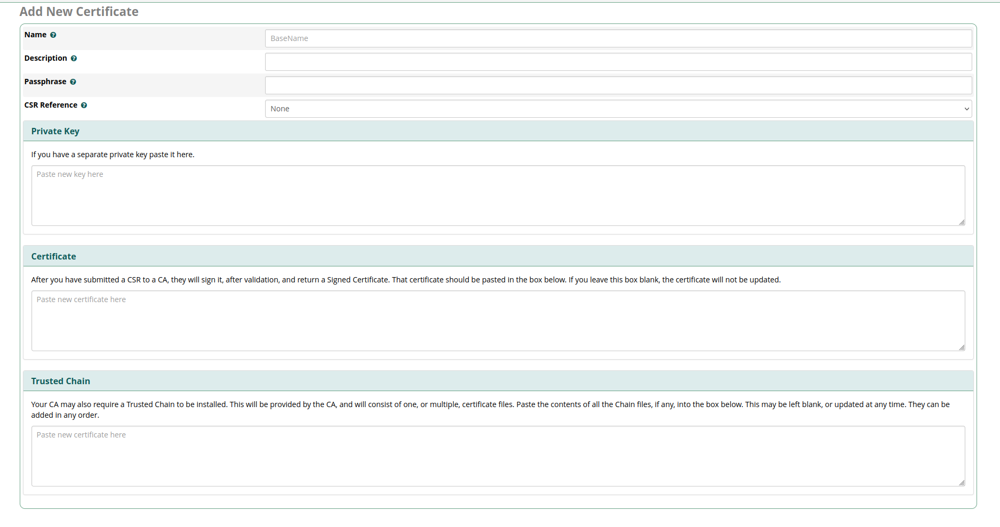

# Freepbx HTTPS Sertifikası Yenileme İşlemi

Freepbx arayüzünün https sertifikasının yenilenmesi için aşağıdaki adımlar uygulanmalıdır. Sertifika yenileme işlemi arayüz üzerinden yapılmalıdır. Eğer arayüz üzerinden yapılmazsa Pbx'in kullandığı Apache restart edildiği zaman eski sertifikaya geri dönebilir ve farkı sorunlar yaratabilir.

## Pbx Arayüzünden HTTPS Sertifikası Yenileme İşlemi

1. Pbx arayüzü için bir HTTPS sertifikası generate edilerek **Admin** -> **Certificate Management** menüsüne gidilir.
2. **New Certificate** -> **Upload Certificate** menüsüne giriş yapılır.

3. **Private Key** kısmına sertifikanın Private Keyi, **Certificate** kısmına sertifika yazılarak sağ alttan Generate Certificate butonuna basılır.
4. Tekrar **Certificate Management** menüsüne dönüp yüklenen seritfika default sertifika olarak ayarlanır.
5. **Admin** -> **System Admin** menüsüne gidilir.
6. **System Admin** menüsünün altından **HTTPS Setup** menüsüne gidilir(Ekranın sağ tarafında)
7. **HTTPS Setup** Menüsünün Settings kısmına gelip yüklenen sertifika **Certificate Manager** menüsü altından seçilir ve install butonuna basılır.
8. Install işlemi bittikten sonra **Save and Restart Apache** butonuna basılır ve Apache yeniden başlatılır.
