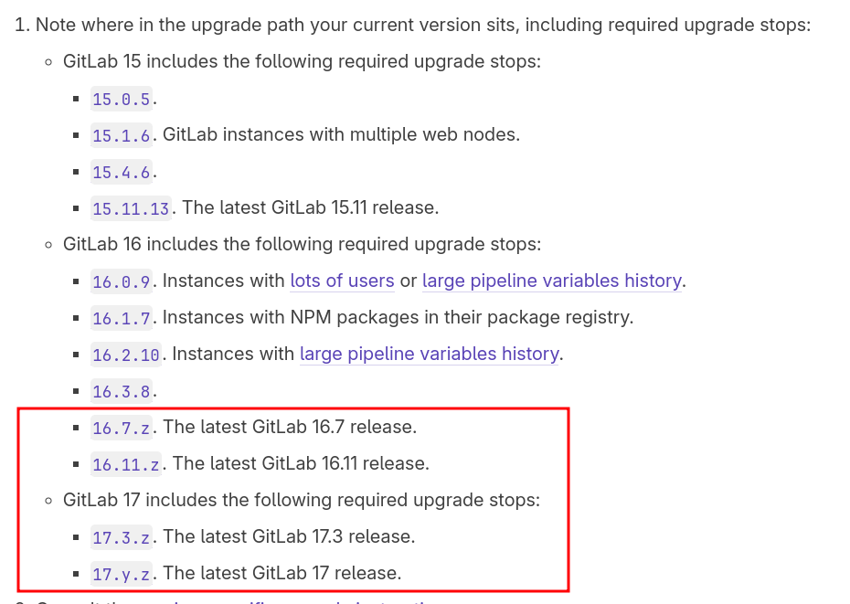

# GitLab Güncelleme Adımları

* Bu döküman GitLab'ın bir Debian sistem üzerine apt repolarından kurulu halinin güncelleme işlemlerini içerir. **Eğer GitLab bir Docker containerı olarak çalışıyorsa uygulanacak olan işlemler farklıdır.**

* Güncelleme işlemi gerçekleştirilmeden önce mutlaka var olan sunucunun yedeği alınmalıdır. KVM ise ```/var/lib/images/``` dizini altındaki ```qcow2``` dosyasının yedeklenmesi yeterlidir.

## Hazırlık

* GitLab'ın resmi sitesinde belirlenen sürüm için bir upgrade path varsa(mutlaka vardır) güncelleme işlemi sırası ile yapılmalıdır.

* Örneğin Gitlab 13'den 15'e güncellenmek isteniyorsa önce GitLab 13.9, sonra 15.x'e güncellenmelidir. Bu kural halihazırda kullanılan GitLab sürümüne ve güncellenmek istenen sürüme göre değişiklik gösterebilir.

* [Buradaki](https://docs.gitlab.com/ee/update/index.html#upgrade-paths) linkten GitLab Upgrade Path öğrenilebilir.



**GitLab 16.8 sürümünde olduğumuzu varsayalım.** **16.8**'den **17.y.z** li bir sürüme güncellemek için ilk önce GitLab **16.11.z** sürümüne, sonra **17.13.z** sürümüne, sonra da **17.7.z** sürümüne geçmemiz gerekmektedir.

* Her zaman bulunan update stopın en son sürümüne güncellenmesi tavsiye edilir. 16.11.z örneğindeki **z** kısmına en güncel sürümün numarası eklenerek bu sürüme güncelleme yapılabilir.

* GitLab güncellenmeden önce kullanıcılara duyuru yapılması tavsiye edilir. Bu işlem sırasında CI işlemleri vs aktif olmayacaktır.


## Yedekleme İşlemi

1. GitLab'ın çalıştığı makineye bağlanarak sunucu aşağıdaki gibi kapatılır.
    
    ```sync && poweroff```

2. Ana host uzerindeki disk alani dikkate alinarak sanal makinenin disk imajinin bir yedegi alinir. (Kullanılan sanallaştırma teknolojisine göre bu adım değişebilir.)

    ```cp gitlab.qcow2 TARIH-gitlab-berk.qcow2```

3. Yedekleme işlemi tamamlandığında gitlab makinesi tekrar başlatılır.

    ```virsh start gitlab```

## Güncelleme İşlemi

1. Belirlenen GitLab sürümüne geçiş yapılır.

**Eğer ara sürüm varsa, her ara sürüm için bu işlemler uygulanır.**

```
root@gitlab:~# apt update
root@gitlab:~# apt install gitlab-ee=<version>-ee.0
```

**Eğer gitlab'ın community edition sürümü kullanılıyorsa paket ismindeki ee, ce olarak değiştirilir.**

```root@gitlab:~# apt install gitlab-ce=<version>-ce.0```

2. Sürüm yükseltmesi tamamlandıktan sonra GitLab yapılandırmasının sağlamlığı kontrol edilir.

```root@gitlab:~# gitlab-rake gitlab:check```

Failed durumda bir madde yoksa bir sonraki adıma geçilir.

3. GitLab'ın arayüzünden GitLab sürümü kontrol edilir.

    https://gitlab-adresi.com/admin

4. GitLab arkaplanda bir migration işlemi yapıyor mu diye kontrol edilir, eğer yapıyorsa tamamlanması beklenir.

    https://gitlab-adresi.com/admin/background_migrations

5. Arkaplandaki migration işlemleri bittikten sonra komut satırından tekrar kontrol edilir.

```
gitlab-rails runner -e production 'puts Gitlab::Database::BackgroundMigration::BatchedMigration.queued.count'
```

Her güncelleme işlemi için bu adımların tekrarlanması gerekmektedir.