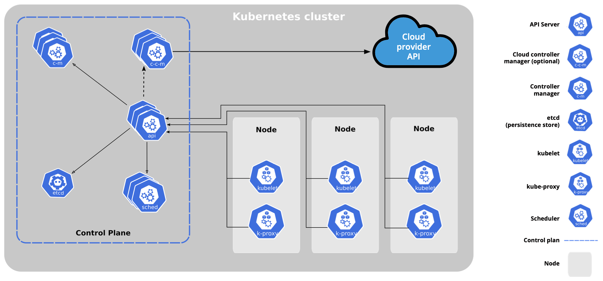

# Kubernetes Mimarisi

Olusturulan bir kubernetes clusteri asagi yukari bu sekildedir. Control plane kisminin genelde ayri bir makinede bulunmasi onerilir. Ayrica birden fazla control plane bulunabilir.

Kaynak: linuxfoundation

## Control Plane Node

Control plane node'u kubernetes clusterini yonetmekten sorumludur. Bir clusterin beynidir denilebilir. Clusteri yonetmek icin Control Plane'e baglanmak gereklidir. Komut satirindan `kubectl` komutu ile veya api uzerinden kontrol edilebilir.

Eger control plane kapanirsa cluster **erisilemez** ve **yonetilemez** durumda kalir. Bu sebepten dolayi birden fazla Control Plane yapilandirilmasi onerilir.

Control Plane Node'daki bilesenler icin: [buradan](control-plane-bilesenleri.md) devam et.

## Worker Node

Worker node, deploy edilen uygulamalar icin calisma ortami saglar. Uygulamalar container'lar halinde podlar icerisinde calisir. Scheduler tarafindan bir worker node'a atanan pod, o node'daki kubelet tarafindanc alistirilir. Podlar, worker node'un CPU, bellek ve depolama kaynaklarini kullanir.

Worker Node'daki bilesenler icin: [buradan](worker-node-bilesenleri.md) devam et.