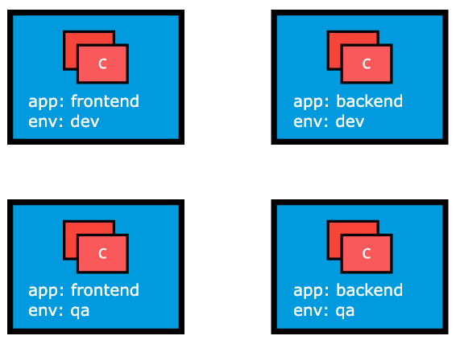

# Label

Label'lar key:value seklinde kubernetes objelerine(pod, replicaset, node, namespace ve persistentVolume) tanimlanan verilerdir. Genelde tanimlanan obje hakkinda bir detay icerir ve **selector tarafindan secilirken kullanilir.**



Kaynak: linuxfoundation

### Label Tanimlama Ornegi

```yaml
apiVersion: v1
kind: Pod
metadata:
  name: nginx-pod
  labels:
    app: frontend
    env: dev
spec:
  containers:
  - name: nginx
    image: nginx:1.22.1

```

Bir servis tanimi bu pod'u nasil secer?

```yaml
apiVersion: v1
kind: Service
metadata:
  name: frontend-service
spec:
  selector:
    app: frontend  # Bu label'a sahip podları seçer
  ports:
  - port: 80
```