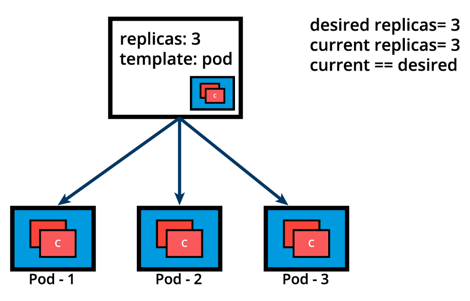

# ReplicaSet

ReplicaSet, yeni nesil ReplicationController'dir. Hem eşitlik tabanli hem de küme tabanlı selectorleri destekler.

Podların yaşam döngüsü ReplicaSet tarafından kontrol edilir. ReplicaSet tanımında kaç adet replika istediğimizi belirtiriz ve podların belirli bir nedenden dolayı kapanması/ulaşılamaması durumunda ReplicaSet yeni bir pod oluşturur. 


kaynak: LinuxFoundation

Replicaset aşağıdaki gibi tanımlanabilir. 3 adet replika oluşturuluyor. Eğer belirli bir nedenden dolayı pod sayısı artar/azalırsa ReplicaSet devreye girip yaptığımız tanımlamaya göre replikasyon işlemini düzenliyor.
    
```
apiVersion: apps/v1
kind: ReplicaSet
metadata:
  name: frontend
  labels:
    app: guestbook
    tier: frontend
spec:
  replicas: 3
  selector:
    matchLabels:
      app: guestbook
  template:
    metadata:
      labels:
        app: guestbook
    spec:
      containers:
      - name: php-redis
        image: gcr.io/google_samples/gb-frontend:v3
```

