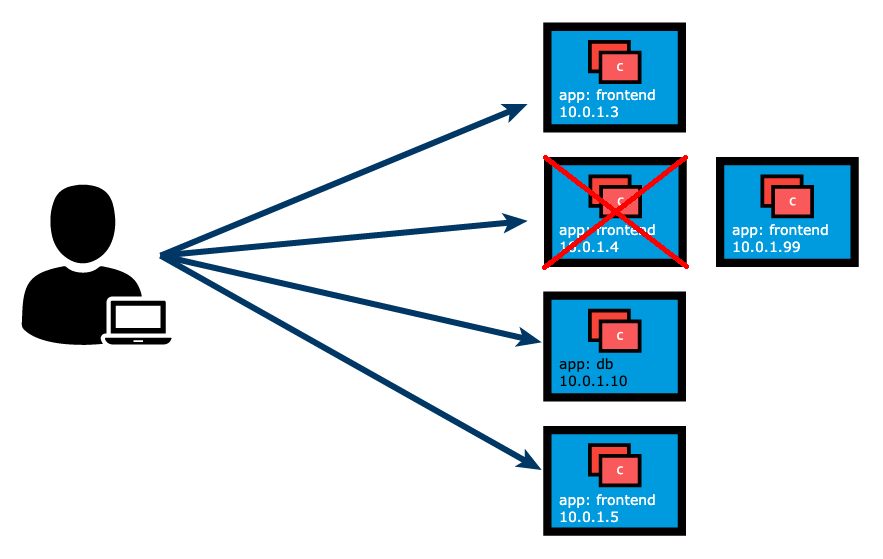
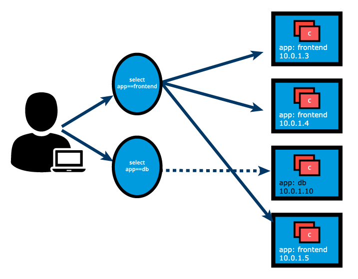
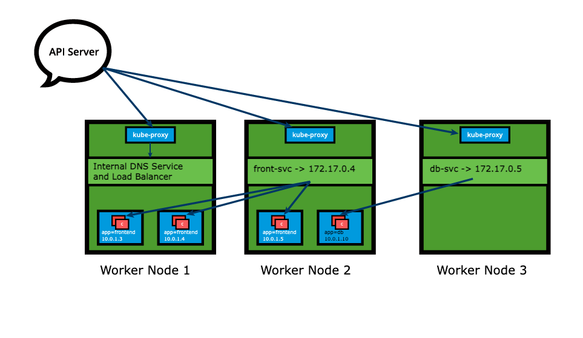
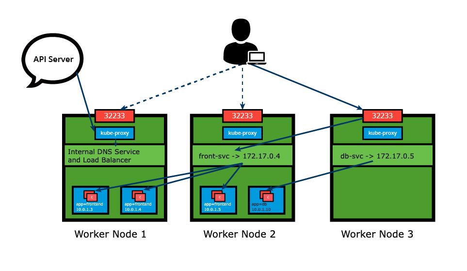

# Service Nedir?

Kubernetes'in amaci uygulamalari mikro servislere bolmek olmasina ragmen sistemi daha rahat yonetebilmek ve gerektiginde yuk dengelemek(load balancing) amaciyla mikro servisleri mantiksal olarak gruplamak gerekmektedir.

Kube-proxy ile birlikte calisir.

**Birden fazla pod halinde deploy edilmis bir uygulamayi ek bir dns kaydi ile erisilebilir kilmaya olanak saglar.**

## Uygulamalara Erisim

Bir uygulamaya erisebilmek icin uygulamalari deploy ettigimiz podlara erisilmelidir fakat podlarin yapisi geregi sabit bir ip adresleri yoktur. Ayrica gereksinimlere gore podlar en cok kapatilan veya hata alarak kendi kendine kapanan yapilardir. Bu sebepten dolayi uygulamaya erisim saglarken podlarin ip adreslerini kullanamayiz.



Yukaridaki gorseldeki gibi bir durum yasandiginda podun ip adresi degisir ve bu ip adresini diger uygulamalar veya kullanicilar bilemez. Bu sorunu cozmek icin Kubernetes'de bulunan service objesini kullanabiliriz. Service objesi podlari mantiksal olarak gruplar ve bu podlara erisim icin bir police belirler. Bu gruplama Label ve Selector ile saglanir.

Ornek:

```yaml
apiVersion: apps/v1
kind: Deployment
metadata:
  labels:
    app: frontend
  name: frontend
spec:
  replicas: 3
  selector:
    matchLabels:
      app: frontend
    template:
      metadata:
        labels:
          app: frontend
      spec:
        containers:
        - image: frontend-application
        name: frontend-application
        ports:
        - containerPort: 5000 
```

Label ve selectorler key:value formatini kullanir.



kaynak: linuxfoundation

Yukaridaki gorselde `app==frontend` ve `app==db` olarak iki farkli sekilde gruplandigi gozlemlenebilir. Bu sayede podlarad cikan sorunlardan sonra podlar yeniden basladiginda ip adresi degisimi oldugunda bile `service` objesi trafigi dogru yere yonlendirir.

Service objesi uygulamalari bir nevi disariya acmaya ve erisilebilir kilmaya yarar.

## Temel Service Tanimi

```bash
apiVersion: v1
kind: Service
metadata:
  name: frontend-svc
spec:
  selector:
    app: frontend
  ports:
  - protocol: TCP
    port: 80
    targetPort: 5000
```

Yukaridaki tanim en temel service tanimidir. Istege ve ihtiyaca gore daha komplike hale getirilebilir. Bu servis tanimi `app` degeri `frontend` olan objelere trafik yonlendirecektir. 

Service'lerin type'lari vardir. Bos biraktigimiz icin default type olan `ClusterIP` typei ile olusur.

***Not: Expose komutu ile bir deployment veya baska bir obje disariya acildiginda aslinda arkaplanda bir service tanimi olusur. Olusan bu service kendi taniminda otomatik olarak expose edilen objenin labelina baglanir.***

## Kube-Proxy

Control Plane'de bulunan API Server'i duzenli olarak izleyen ve buna gore service ve endpointleri duzenleyen yapidir. Her node'da bir adet bulunur. Tanimlamalara gore networku yonetir. Arkaplanda `iptables` kullanir. Trafigi alir ve ilgili service objesine yonlendirir.



kaynak: linuxfoundation

## Trafik Policeleri

Kube-proxy arkaplanda iptables kullandigi icin yuk dengeleme ozelligi varsayilan olarak tamamen random bir sekilde ilerler. Bu yontem de pratikte ne efektif ne de trafiksel olarak en optimal podu secmeye yarar. Daha iyi trafik policileri istiyorsak Kubernetes'in bize sunduklarini kullanabiliriz.

Iki adet trafik policesi vardir:

- Cluster Opsiyonu: Bu opsiyon hazirda bulunan butun endpointlere(farkli nodelarda bulunan endpointler dahil) trafik yonlendirir. Herhangi ek bir tanim yapilmazsa kubernetes default olarak Cluster opsiyonunu kullanir.
- Local Opsiyonu: Sadece ayni node uzerinde bulunan endpointlere trafik yonlendirir.

**Not: Eğer trafiğin geldiği Node üzerinde ilgili uygulamaya ait "Ready" (hazır) durumda bir Pod yoksa, Kubernetes trafiği başka bir Node'a aktarmaz ve istek başarısız olur (drop edilir).**

## Servis Tipleri

Servis tanimlarken bu servisin nerelerden/nasil erisilebilecegini ayarlayabiliriz. 

### ClusterIP ve NodePort

ClusterIP varsayilan servis tipidir (ServiceType). Bir servis, ClusterIP olarak bilinen bir sanal IP adresi (Virtual IP) alir. Bu sanal IP adresi, servis ile iletisim kurmak icin kullanilir ve sadece cluster icerisinden erisilebilirdir. frontend-svc servis tanim manifestosu artik acikca belirtilmis bir ClusterIP tipi icermektedir. Eger bu kisim bos birakilirsa, varsayilan olarak ClusterIP servis tipi ayarlanir:

```yaml
apiVersion: v1
kind: Service
metadata:
  name: frontend-svc
spec:
  selector:
    app: frontend
  ports:
  - protocol: TCP
    port: 80
    targetPort: 5000
  type: ClusterIP 
```

NodePort servis tipiyle (ServiceType) birlikte, bir ClusterIP'ye ek olarak, varsayilan 30000-32767 araligindan dinamik olarak secilen bir port, tum worker node'lar uzerinden ilgili servise eslenir. Ornegin; frontend-svc servisi icin eslenen NodePort 32233 ise, herhangi bir worker node'a 32233 portundan baglandigimizda, node tum trafigi atanan ClusterIP'ye (172.17.0.4) yonlendirir. Eger belirli bir port numarasi kullanmayi tercih edersek, servisi olustururken varsayilan araliktan istedigimiz o port numarasini NodePort'a atayabiliriz. NodePort tipi secilince arkaplanda aslinda otomatik olarak bir ClusterIP adresi de bu servise verilir.

Ozetle mantik su sekilde ilerler:

- ClusterIP: Sadece bir sanal IP verir (Cluster icinden erisim).
- NodePort: Arka planda otomatik olarak bir ClusterIP olusturur, sonra bunun uzerine bir de "disaridan su portla gelince icerideki bu ClusterIP'ye git" kuralini ekler.


kaynak: linuxfoundation

NodePort servis tipi, servislerimizi dis dunyadan erisilebilir kilmak istedigimizde kullanislidir. Son kullanici, belirlenen port uzerinden herhangi bir worker node'a baglanir; node ise bu istegi dahili olarak servisin ClusterIP adresine yonlendirir ve ardindan istek kume icinde calisan uygulamalara iletilir. Servisin bu istekleri yuk dengeledigini (load balancing) ve istegi hedef uygulamayi calistiran Pod'lardan yalnizca birine ilettigini unutmamak gerekir. Dis dunyadan cok sayida uygulama servisine erisimi yonetmek icin yoneticiler bir ters vekil sunucu (reverse proxy) olan Ingress yapilandirabilir ve kume icindeki belirli servisleri hedefleyen kurallar tanimlayabilirler.

NodePort tipi, servis tanim manifestosunda veya daha onceki derslerde gordugumuz expose ve create service komutlariyla acikca belirtilmelidir. nodePort: 32233 degerini manuel olarak tanimlamak opsiyoneldir; tanimlanmazsa sistem bos bir portu otomatik atar. NodePort tipi icin guncellenmis servis tanimini ve komutlari asagida gorebilirsiniz:

```yaml
apiVersion: v1
kind: Service
metadata:
  name: frontend-svc
spec:
  selector:
    app: frontend
  ports:
  - protocol: TCP
    port: 80
    targetPort: 5000
    nodePort: 32233
  type: NodePort
```

Komut satiri ornekleri:

```kubectl expose deploy frontend --name=frontend-svc --port=80 --target-port=5000 --type=NodePort```
```kubectl create service nodeport frontend-svc --tcp=80:5000 --node-port=32233```