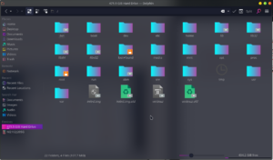

# Bilgisayar İçerisinde Gezinmek

Daha önce bir grafik arayüz aracılığı ile bilgisayar kullandıysanız(Windows) klasörler arasında gezinmişsinizdir. Komut satırı kullanırken klasörleri **dizin** olarak adlandırıyoruz. Bir dizin içerisinde yaptığımız değişiklikler tıpkı grafik arayüzünde olduğu gibi klasörün/dizinin içerisine yansıtılır.

Linux dosya sisteminde ilk dizine **root**(kök) adı verilir ve **“/”** işaretiyle gösterilir.(Sadece bir adet eğik çizgi) Sistemdeki bütün dizinleri ve dosyaları bu kökten baş aşağı büyüyen bir ağaç gibi düşünebilirsiniz.




Yukarıdaki görselde de gördüğünüz üzere Linux Dosya Sisteminde bulunan bütün dizinler root dizini içerisinde bulunuyor.

Peki bir dizinin(klasörün) içerisindeki dizinler nasıl gösterilir? Çok basit. **Root** dizinini temsil eden / işareti ile dizinlerin bulunduğu konumu gösterebiliriz. Diyelim ki bilgisayarınızda masaüstü kısmında kısmında bulunan **resimler** adında bir dizinimiz var. Bu dizini komut satırında bu şekilde gösterebiliriz.

```
/home/KULLANICI_ADI/Desktop/resimler
```

Linux dosya sisteminde sistem içerisinde bulunan kullanıcılara ait olan dizinler home isimli dizinin altında bulunur. Tabi şimdilik bizi ilgilendiren kısım bu değil. Linux dosya sistemi konusuyla ilerleyen zamanlarda ilgilenmeliyiz.

**Dizinlerle Alakalı Linux Komutları**

Linux üzerinde dizinlerin ve uygulamaların adreslerinin nasıl gösterildiğini öğrendik. Peki komut satırını kullanarak dizinler arasında nasıl gezinebiliriz? Veya bulunduğumuz dizini nasıl öğrenebiliriz? Başlayalım:

**pwd**

**pwd** komutu ile bulunduğumuz dizini öğrenebiliriz. Bu komutun açılımı **P**rint **W**orking **D**irectory’dir. Komutların açılımlarını bilirseniz komutları ezberlemeniz çok daha kolay olabilir. Fakat bir süre kullandıktan sonra ister istemez ezberliyorsunuz. Eğer bu kadar komutu nasıl ezberleyeceğim ben şeklinde bir kaygınız varsa olmasınç 🙂

Hadi pwd komutunu kullanalım. Acaba bize nasıl bir çıktı verecek?

```
$ pwd
home/berk
```
_Komut satırında gezinirken teknik olarak sürekli “bir dizinin içerisinde” bulunuruz._

Gördüğünüz üzere pwd komutu içerisinde bulunduğumuz dizini bize gösteriyor. Peki bulunduğumuz dizini nasıl değiştirebiliriz? Bunun için cd komutunu kullanabiliriz. Açılımı **Change Directory** olan bu komut sayesinde içerisinde bulunduğumuz dizini değiştirebiliriz.

```
$ cd /
```

Az önce yukarıdaki komutu kullanarak içerisinde bulunduğumuz dizini **root** dizini olarak ayarladık. Eğer az önce bulunduğumuz dizine geri dönmek istiyorsak cd komutunu bu şekilde kullanabiliriz:

```
$ cd home/berk
```
İçerişinde bulunduğumuz dizini alternatif bir yöntemle de değiştirebiliriz. **cd** komutuna direkt içerisinde bulunmak istediğimiz dizinin adresini göndermek yerine tek tek dizinler içerisine giriş yapabiliriz.

```
$ cd /
$ cd home
$ cd berk
$ pwd
home/berk
```
Az önce root dizininin içerisinden önce home isimli dizine girdik, sonra berk isimli dizine girdik.

Az önce de bahsedildiği gibi linux dosya sistemi üzerinid bulunan kullanıcılar genellikle home dizini içerisinde kendi isimleriyle özel bir dizine sahip olurlar. Bu sebepten dolayı kendimizi home dizini üzerine bolca yolculuk yaparken bulabiliriz. Her seferinde **/**_**home**_**/berk** yazmak yerine daha kolay bir yöntem kullanabiliriz.

Tilda(~) işareti ile **/home** dizinini gösterebiliriz. Tilda işareti ile home dizini içerisindeki berk isimli dizine gitmek için cd komutunu şu şekilde kullanabiliriz:

```
$ cd ~/berk
```

```
$ pwd
home/_berk
```
Peki içerisinde bulunduğumuz dizini veya bir üst dizini nasıl belirtebiliriz? Linux dosya sistemini(aslında Windows’da da böyle) kökten baş aşağı doğru büyüyen bir ağaç olarak düşünebiliriz demiştik.

**.** ve **..** ile içerisinde bulunduğumuz dizini ve bir üst katmanda bulunan dizini gösterebiliriz.

Bulunduğumuz dizinin bir üstünde bulunan dizine geçiş yapmak için cd komutunu şu şekilde kullanabiliriz:

```
$ pwd
/home_/berk/
```
```
$ cd ..
```
```
$ pwd
/home
```
Yukarıda da örneğini gördüğümüz üzere .. argümanını **cd** komutuna gönderdiğimizde otomatik olarak bir üstteki dizine geçtik. Tahmin ettiğiniz üzere bulunduğumuz dizini belirtmek için de sadece “.” işaretini kullanıyoruz. Fakat bu işareti cd komutuna argüman olarak göndermemiz oldukça anlamsız olucaktır çünkü bizi zaten hali hazırda bulunduğumuz dizine gönderecektir. Bu işareti genellikle içerisinde bulunduğumuz dizindeki bir dosyayı veya scripti çalıştırmak için kullanırız. Diyelim ki vim isimli bir dizindeyiz.(Vim, komut satırı üzerinde kullanılabilen bir text editörüdür, buna sonra değineceğiz.)

vim dizini içerisine girip Vim’i başlatmak için:
```
$ ./vim
```
komutu bu şekilde kullanabiliriz.

Ayrıca .. işaretini biraz daha kompleks bir şekilde kullanabiliriz. Diyelim ki /_home_/berk/Desktop dizinindeyiz ve direkt root dizinine dönmek istiyoruz. Veya bulunduğumuz dizinin iki üst dizinine çıkmak istiyoruz. cd komutunu şu şekilde kullanabiliriz:

```
$ cd ../../..
```
```
$ pwd
```
```
$ /
```
Komut satırını kullanarak dizinler arasında gezinerek cd komutuna elinizi alıştırabilirsiniz. Belli bir süre geçtikten sonra grafik arayüzü asla kullanmak istemeyeceksiniz. 🙂
