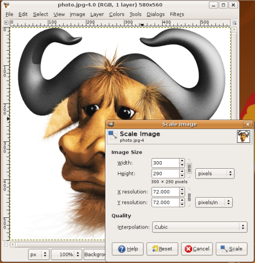

Komut satırı kullanarak işlemlerimizi gerçekleştirmek bizi normalden çok daha hızlı ve sistem üzerinde daha çok kontrol sahibi yapar. Kontrol sahibi yaptığı inandırıcı da gerçekten bizi daha hızlı yapıyor mu?

Evet.

Küçük bir örnekle açıklayalım:

Diyelim ki bir fotoğraf makinesi sahibisiniz ve elinizde fotoğraflarla dolu bir dizin var ve bu dizinin içerisindeki  _profile.jpg_ isimli bir fotoğrafı yeniden boyutlandırmak istediniz. Yeniden boyutlandırdıktan sonra da farklı bir isimle tekrar kaydetmek istiyorsunuz.

Herhangi bir resim düzenleme programında aşağı yukarı bu adımları izlemeniz gerekir:

1 – Uygulamalar menüsünden resim düzenleme programınızı açarsınız.  
2 – Dosya – Aç  
3 – Gelen dosya açma ekranından fotoğrafların olduğu dizine git.  
4 –  _profile.jpg_ isimli dosyayı bulup seçtikten sonra Aç tuşuna bas.  
5 – Resim – Boyutlandır menüsünden boyutlandırma ayarlarını aç.  
6 – Fotoğrafın genişliğini 300 piksel olarak ayarla.  
7 – Dosya – Farklı Kaydet menüsünden kaydedilecek yeri seç.  
8 – Dosya ismi olarak  _profile_küçük.jpg_ yaz ve Kaydet butonuna tıkla.



Komut satırını kullanarak bu işlemi tek bir satırda halledebiliriz. Nasıl mı?

```
convert -resize 300 profile.jpg profile_küçük.jpg
```

Komut satırındaki bir satır, neredeyse resim düzenleme programındaki sekiz işleme eşit. Şuan belki de bu işlemi yaparken geçen 15-20 saniyenizi önemsemiyorsunuz fakat 30 farklı fotoğrafı düzenlemeniz gerekseydi ne yapmak isterdiniz? 30 farklı fotoğraf için yukarıdaki sekiz adımı sürekli tekrarlamak ister miydiniz? Totalde 240 adım ediyor. Bunun yerine bütün işlerinizi tek satırda halletmek isteyeceğinizi varsayıyorum.

## **Komut Satırı Kullanmanın Avantajları**

Komut satırına bir kere şans veren insanlar genellikle asla grafik arayüz kullanmaya geri dönmüyorlar. Sebebi çok basit, Komut satırı(Terminal) kullanmak grafik arayüzü kullanmaktan hem daha  **hızlı**, daha  **stabil**, daha esnek, çok daha  **eğlenceli** ve çok farklı bir  **deneyim**. Komut satırı kullanarak bilgisayarınızla çok dafa farklı bir şekilde iletişim kurabilirsiniz.

**Güzel Bir Özellik Daha: Scripting**

Kullandığınız komutları text dosyalarına dönüştürebileceğinizi biliyor muydunuz? Bu text dosyalarına  **script** denir ve genellikle her seferinde uzun komutlar yazmak yerine kullanmak istediğimiz komutları kaydederek sürekli kullanmamızı sağlarlar.

**`komutlarim.sh`**

.sh uzantılı bir dosyanın içerisinde komutlarınızı kombine ederek kullanabilirsiniz! İlk önce komut satırını kullanmayı öğrendikten sonra Bash Scripting öğrenebilirsiniz.

**Grafik Arayüze Sahip Olmayan Uygulamalar**

Komut satırı kullanmanın en çok gerektiği ve en çok işe yaradığı anlar grafik arayüze sahip olmayan uygulamaları kullanmamız gerektiğinde ortaya çıkıyor. Diyelim ki bir network’ümüz var, bu network’teki bir bilgisayarı kapatmak istiyoruz. Bilgisayarın yanına kadar gidip kapatma tuşuna basmak yerine komut satırından  **shutdown** komutunu çalıştırmak güzel bir fikire benziyor. Tabi bu bilgisayarın kapatma düğmesine ayağınız ile erişebiliyorsanız farklı bir seçim yapabilirsiniz. 🙂

**Aslında Grafik Arayüze Sahip Olan Programlar da Komutlarla Çalışır**

Grafik arayüze sahip programları kullanırken menülerden tıkladığımız seçenekler aslında birer komuttur diyebiliriz. Bir programı çalıştırmak için bir menüye veya bir ikona tıkladığınızda aslında bir komut çalıştırmış olursunuz.

Komut satırının faydalarından ve ne kadar eğlenceli bir şey olduğundan yeterince bahsettik. Artık başlayabiliriz. 🙂