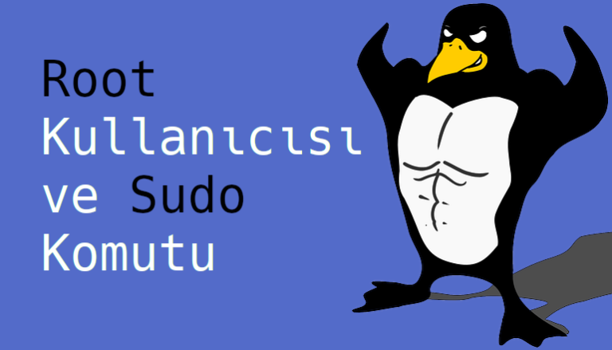

# Root Kullanıcısı ve Sudo Komutu

**Linux** sistemimizin bazı kısımları özel korumaya ihtiyaç duyar. Eğer her kullanıcı ```cat```, ```less```, ```cd```, ```mkdir``` gibi komutların işlevini değiştirebiliyor olsaydı(sadece siz değiştirebilirsiniz) ortada çok büyük bir güvenlik zaafiyeti olurdu. Sadece internet üzerinden indirdiğiniz bir programın ```rm``` komutunun işlevini ```cd``` komutuna verdiğini düşünün. Bilgisayarınızdaki dizinleri kendi elinizle silmiş olurdunuz. Bu tarz önemli değişiklikleri sadece **root** kullanıcısı yapabilir.



## Sudo komutu ve Root Kullanıcısı

Bilgisayarların bu kadar ulaşılabilir olmadığı dönemlerde çoğunlukla bir bilgisayarı birden fazla kişi kullanıyordu. **Root** kullanıcısı da genellikle bilgisayarın gerçek sahibine veya biraz daha tecrübeli kullanıcılara veriliyordu. Sebebini doğru tahmin ediyorsunuz.

Günümüzde de hala **GNU/Linux** sistemlerde hassas/önemli dosyaların sahibini belirlemek için bir adet root kullanıcısı bulunur.  
  
_Dipnot: Linux dosya sisteminde bulunan root dizininin(/) root kullanıcısı ile aslında bir alakası yoktur._

Root komutları maksimum yetkiye sahip olduğu için dikkatli kullanılmaları gerekir. Fakat her koşulda bilgisayarınıza bir yazılım kurmak istediğinizde bile bu yetkiye kısa bir süreliğine sahip olmanız gerekir.

## Sudo Komutu

Çoğu modern sistemde çalıştırmak istediğiniz komutun root yetkileri ile çalışmasını istiyorsanız çalıştırmak istediğiniz komutun başına **sudo** yazmanız yeterli olacaktır.(Tabi bunun için sudo’nun bilgisayarınızda kurulu olması gerekir)

```
$ sudo rm -r /silinmek_istenen_dizin
```

Örnekteki komutu sudo ile çalıştırmak istediğinizde sistem size root parolanızı soracaktır. Bu koruma yöntemi sayesinde de her kullanıcı istediği komutu root yetkileri ile çalıştıramayacaktır. Ayrıca sistem belli bir süreliğine sizin root parolanızı hatırlayacaktır, yani sudo komutunu her kullandığınızda parolanızı tekrar girmek zorunda kalmazsınız.

Bazı sistemler kullanıcının _su_ komutunu kullanmasına da izin verir. Bu komut sizi yeni bir komut satırına göndererek **root kullanıcısı** ile otomatik giriş yapar.  
  
Bu özelliğe varsayılan olarak her sistemin izin vermemesinin sebebi genellikle kullanıcıların dalgınlıkla root kullanıcısında olduğunu farketmeyip gündelik işlerini root kullanıcısı ile yapmaları. Örneğin kendi masaüstünüzde root kullanıcısı ile bir dizin oluşturursanız bu dizin root kullanıcısına ait olacak ve bu dizine kendi kullanıcı hesabınızla erişemeyeceksiniz. Tabii ki bunu düzeltmenin yolları var fakat neden ekstra birşey ile uğraşalım ki?

Uzun lafın kısası sisteminizde root olarak gezinmeyin, root parolanızı da kimseyle paylaşmayın. 😀 [**Büyük güç, büyük sorumluluk gerektirir.**](https://github.com/sudo-project/sudo)
