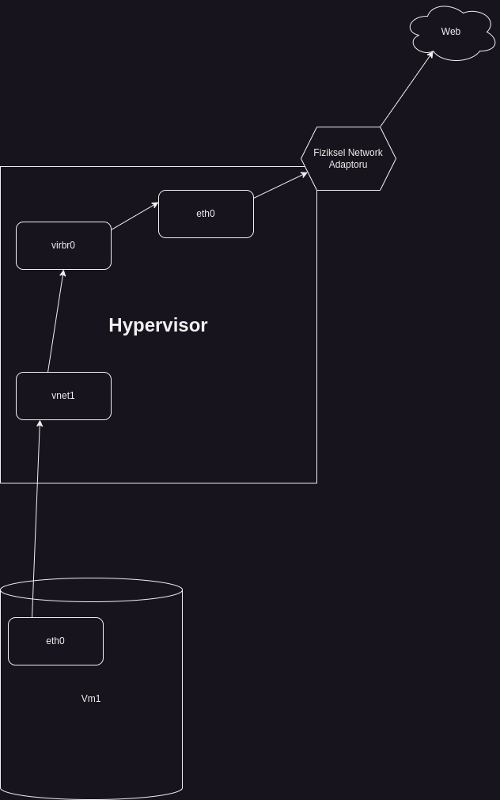

# Libvirt'in Network Sistemi

## Libvirt Uzerinde Calisan Default Network

Asagidaki komut ile libvirt ile birlikte calisan networkler listelenebilir.

```
virsh net-list --all
```

Libvirt kurulumu ile birlikte gelen varsayilan networkun adi defaultdur. Ilk kurulumda otomatik olarak baslamaz, el ile baslastilmasi ve duruma gore autostart hale getirilmesi gerekebilir.

Bu network baslatildiktan sonra virbr0 adinda bir network interfaceinin olustugunu gorebiliriz. 4 numarali interface. **Bu interface sanal bir switch gorevi gorur. Olusturulan sanal makineler bu switch'e bagliymis gibi davranir.**

```
berk@berk-notebook:~/Documents/repos/docs$ ip a
1: lo: <LOOPBACK,UP,LOWER_UP> mtu 65536 qdisc noqueue state UNKNOWN group default qlen 1000
    link/loopback 00:00:00:00:00:00 brd 00:00:00:00:00:00
    inet 127.0.0.1/8 scope host lo
       valid_lft forever preferred_lft forever
    inet6 ::1/128 scope host noprefixroute 
       valid_lft forever preferred_lft forever
2: enp4s0: <NO-CARRIER,BROADCAST,MULTICAST,UP> mtu 1500 qdisc fq_codel state DOWN group default qlen 1000
    link/ether 88:a4:c2:54:35:af brd ff:ff:ff:ff:ff:ff
3: wlp0s20f3: <BROADCAST,MULTICAST,UP,LOWER_UP> mtu 1500 qdisc noqueue state UP group default qlen 1000
    link/ether cc:15:31:ea:8d:ff brd ff:ff:ff:ff:ff:ff
    inet 192.168.1.178/24 brd 192.168.1.255 scope global dynamic noprefixroute wlp0s20f3
       valid_lft 70988sec preferred_lft 70988sec
    inet6 fd00::bdfb:aa4a:5494:e47d/64 scope global temporary dynamic 
       valid_lft 29sec preferred_lft 29sec
    inet6 fd00::a54a:d2b6:a31e:cbc2/64 scope global dynamic mngtmpaddr noprefixroute 
       valid_lft 29sec preferred_lft 29sec
    inet6 fe80::e6c3:321a:f4cc:d0c2/64 scope link noprefixroute 
       valid_lft forever preferred_lft forever
4: virbr0: <BROADCAST,MULTICAST,UP,LOWER_UP> mtu 1500 qdisc noqueue state UP group default qlen 1000
    link/ether 52:54:00:91:e2:8d brd ff:ff:ff:ff:ff:ff
    inet 192.168.122.1/24 brd 192.168.122.255 scope global virbr0
       valid_lft forever preferred_lft forever
```

## DHCP ve DNSMASQ

Libvirt kurulumu ile birlikte gelen, arkada calisan bir process mevcut. Adi dnsmasq.

```
berk@berk-notebook:~/Documents/repos/docs$ ps aux | grep -i dnsmasq
libvirt+    3777  0.0  0.0  11484  2348 ?        S    09:19   0:01 /usr/sbin/dnsmasq --conf-file=/var/lib/libvirt/dnsmasq/default.conf --leasefile-ro --dhcp-script=/usr/lib/libvirt/libvirt_leaseshelper
root        3778  0.0  0.0  11484  1708 ?        S    09:19   0:00 /usr/sbin/dnsmasq --conf-file=/var/lib/libvirt/dnsmasq/default.conf --leasefile-ro --dhcp-script=/usr/lib/libvirt/libvirt_leaseshelper
dnsmasq     4765  0.7  2.9 2037796 470492 ?      Ssl  09:19   6:04 mysqld
berk      911011  0.0  0.0   9144  2304 pts/0    S+   23:22   0:00 grep --color=auto -i dnsmasq
```

Dnsmasq, kucuk networkler icin tasarlanmis DNS ve DHCP sunucusudur. Genellikle local networklerde DNS isteklerini cozmek, ip adresleri atamak ve ag yonetimini kolaylastirmak amaciyla kullanilir. Yani libvirt'in default networkunu kullandigimizda aslinda ipleri dagitan yazilim dnsmasq diyebiliriz.

Buradan dnsmasq'in configine bakarak dhcp-range'ini ogrenebiliriz. Bu ayarlar libvirt tarafindan otomatik olarak yapilir.

```
berk@berk-notebook:~/Documents/repos/docs$ sudo cat /var/lib/libvirt/dnsmasq/default.conf 
[sudo] password for berk: 
##WARNING:  THIS IS AN AUTO-GENERATED FILE. CHANGES TO IT ARE LIKELY TO BE
##OVERWRITTEN AND LOST.  Changes to this configuration should be made using:
##    virsh net-edit default
## or other application using the libvirt API.
##
## dnsmasq conf file created by libvirt
strict-order
user=libvirt-dnsmasq
pid-file=/run/libvirt/network/default.pid
except-interface=lo
bind-dynamic
interface=virbr0
dhcp-range=192.168.122.2,192.168.122.254,255.255.255.0
dhcp-no-override
dhcp-authoritative
dhcp-lease-max=253
dhcp-hostsfile=/var/lib/libvirt/dnsmasq/default.hostsfile
addn-hosts=/var/lib/libvirt/dnsmasq/default.addnhosts
```

Linux bir makineye libvirt kurulumu yapildiginda ve default network aktif edildiginde otomatik olarak sanal bir bridge ve dhcp serveri otomatik olarak kuruluyor.

## Sanal Makineler ve Libvirt'in Network Sistemi

Simdi sanal makinelerimizin durumlarini inceleyelim.

```
berk@berk-notebook:~/Documents/repos/docs$ virsh list --all
 Id   Name             State
---------------------------------
 -    debian12-fresh   shut off
 -    ubuntu24.04      shut off
```

Goruldugu uzere 2 adet sanal makine var ve ikisi de kapali gozukuyor. ```virsh dumpxml``` komutu ile bu sanal makinelerin ayar dosyalarini terminal uzerinde gorunteleyebiliriz.

```
berk@berk-notebook:~/Documents/repos/docs$ virsh dumpxml debian12-fresh | grep 'network='
      <source network='default'/>
```

debian12-fresh isimli sanal makine network olarak **default** isimli networku kullaniyor. Yani Hypervisor olarak gorev yapan ana makinemizin uzerindeki virbr0 isimli interface uzerinden baglanti sagliyor.

Bu sanal makineyi calistirdiktan sonra gerceklesen degisiklikleri gozlemleyelim;

```
virsh start debian12-fresh
```

Sanal makinemizi baslattiktan sonra ip a komutu ile interfacelerimizi tekrar kontrol edelim:

```
14: vnet1: <BROADCAST,MULTICAST,UP,LOWER_UP> mtu 1500 qdisc noqueue master virbr0 state UNKNOWN group default qlen 1000
    link/ether fe:54:00:81:86:f7 brd ff:ff:ff:ff:ff:ff
    inet6 fe80::fc54:ff:fe81:86f7/64 scope link 
    valid_lft forever preferred_lft forever
```

Yeni bir network interface'in belirdigini gozlemleyebiliriz. Bu olusan interface sanal makinenin bagli oldugu interfacedir. Gercekte sanal makinenin bagli oldugu switch olarak dusunebiliriz. 

Ayrica Interface'in detaylarina baktigimizda ```master virbr0 state UNKNOWN``` yazdigini gorebiliriz. Yani bu interface ```virbr0``` isimli interface'e bagli. **virbr0** da default isimli libvirt networkunun olusturdugu interface. **Basitce** asagidaki gibi gorsellestirebiliriz.




## Hypervisor (KVM Host) Uzerindeki Routing Table

Trafik host uzerindeki routing table kurallarina gore yonlenir. Host berkbal.com'a ulasmak istediginde gateway uzerinden yonlenir. Asagidaki komut ile routing table'a goz atabiliriz.

```
berk@berk-notebook:~/Documents/repos/docs$ route
Kernel IP routing table
Destination     Gateway         Genmask         Flags Metric Ref    Use Iface
default         _gateway        0.0.0.0         UG    600    0        0 wlp0s20f3
172.17.0.0      0.0.0.0         255.255.0.0     U     0      0        0 docker0
172.18.0.0      0.0.0.0         255.255.0.0     U     0      0        0 br-970466c5d983
172.19.0.0      0.0.0.0         255.255.0.0     U     0      0        0 br-4b58726a0486
172.20.0.0      0.0.0.0         255.255.0.0     U     0      0        0 br-8fdaf0fbab2e
192.168.1.0     0.0.0.0         255.255.255.0   U     600    0        0 wlp0s20f3
192.168.122.0   0.0.0.0         255.255.255.0   U     0      0        0 virbr0
berk@berk-notebook:~/Documents/repos/docs$ 
```

default isimli kaynak ```wlp0s20f3``` isimli interface uzerinden internete cikis yapiyor.

Lıbvırt'in varsayılan network yapisi bu sekilde calisiyor.

# Bridge Olusturmak

Varsayilan bridge'i kullanmak istemiyorsak veya baska bir bridge ihtiyaci duyuyorsak yeni bir birdge olusturabiliriz.

```ip``` isimli araci kullanarak yeni bir bridge aygiti ekleyebiliriz.

```
ip link add name br1 type bridge
```

Bu sekilde bir bridge tanimladiktan sonra bunu default libvirt network yapisinda oldugu gibi fiziksel ethernet cihazina baglamamiz gerekiyor.

```
ip link set eno1 master br1
```

**Buradaki eno1 fiziksel cihazinizi temsil eden interface olmali.**

Simdi ekledigimiz bridge'e bir ip adresi verelim.

```
ip addr add 192.168.1.4/24 dev br1 brd 192.168.1.255
```

```ip a``` komutunun ciktisina baktigimizda bu interfacein bir ip adresine sahip oldugunu gorebiliriz. 

```
18: br1: <BROADCAST,MULTICAST> mtu 1500 qdisc noop state DOWN group default qlen 1000
    link/ether 16:6f:bb:49:6a:09 brd ff:ff:ff:ff:ff:ff
    inet 192.168.4.7/16 brd 192.168.255.255 scope global br1
    valid_lft forever preferred_lft forever
```

interface'in state'i DOWN durumda. Ayaga kaldiralim:

```
ip link set up br1
```

Tekrar ip a komutu ile kontrol ettigimizde state UP olarak gormeliyiz.

```
18: br1: <BROADCAST,MULTICAST,UP,LOWER_UP> mtu 1500 qdisc noqueue state UP group default qlen 1000
    link/ether 16:6f:bb:49:6a:09 brd ff:ff:ff:ff:ff:ff
    inet 192.168.4.7/16 brd 192.168.255.255 scope global br1
       valid_lft forever preferred_lft forever
    inet6 fd00::d287:2e0d:95f7:bee6/64 scope global temporary dynamic 
       valid_lft 30sec preferred_lft 30sec
    inet6 fd00::146f:bbff:fe49:6a09/64 scope global dynamic mngtmpaddr 
       valid_lft 30sec preferred_lft 30sec
    inet6 fe80::146f:bbff:fe49:6a09/64 scope link 
       valid_lft forever preferred_lft forever
```

```
route add default gw 192.168.1.1 dev br1
```

### Libvirt'e Oluşturduğumuz Bridge'i Entegre Etmek

Manuel olarak oluşturduğumuz br1 isimli köprüyü Libvirt'in tanıması ve kullanabilmesi için bir Libvirt ağ tanımı (network definition) oluşturmamız gerekiyor.

Öncelikle, yeni köprümüz için bir XML tanım dosyası oluşturalım. Örneğin, br1-network.xml adında bir dosya yaratabiliriz:

```
<network>
  <name>br1-network</name>
  <forward mode='bridge'/>
  <bridge name='br1'/>
  <ip address='192.168.4.1' netmask='255.255.255.0'>
    <dhcp>
      <range start='192.168.4.100' end='192.168.4.200'/>
    </dhcp>
  </ip>
</network>
```

XML dosyasını oluşturduktan sonra, bu tanımı Libvirt'e eklemeliyiz.

```
virsh net-define br1-network.xml
```

Tanımladığımız ağı başlatmak için:

```
virsh net-start br1-network
```

Sistem yeniden başlatıldığında bu ağın otomatik olarak başlamasını istersek:

```
virsh net-autostart br1-network
```

Artık ```virsh net-list --all``` komutuyla yeni br1-network ağını listede görebiliriz.

### Sanal Makineleri Yeni Bridge'e Bağlamak

Sanal makinelerimizi bu bridge yapısına bağlamak istersek sanal makinenin XML dosyasını düzenlememşiz gerekmektedir.

Örneğin, virsh edit debian12-fresh komutunu kullanarak sanal makinenin XML dosyasını aç ve ağ arayüzü (network interface) tanımını aşağıdaki gibi güncelle:

<interface type='network'>
  <mac address='52:54:00:xx:xx:xx'/> <!-- Mevcut MAC adresini aynı bırakıyoruz -->
  <source network='br1-network'/> <!-- Buradaki 'default' yerine 'br1-network' yazıyoruz -->
  <model type='virtio'/>
  <address type='pci' domain='0x0000' bus='0x01' slot='0x00' function='0x0'/>
</interface>

Bu değişikliği yaptıktan sonra sanal makineyi kapatıp tekrar başlatmak gerekecek:

```
virsh shutdown debian12-fresh
virsh start debian12-fresh
```

Sanal makine başladığında, artık br1 köprüsü üzerinden bağlanacak.