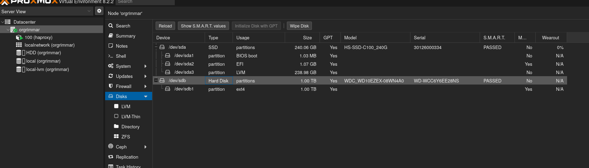

# Proxmox'a Yeni Disk Ekleme

- Disk sunucuya takildiktan sonra proxmox'un arayuzune girilir.
- **Datacenter** menusunden yeni eklenen disk secilerek (dev/sdb) Wipe Disk secenegine tiklanir ve disk temizlenir. (Bu islemden sonra diskinizdeki veriler kaybolacaktır. Bu islemden once yedekleme yapmaniz gerekiyorsa mutlaka yapmalisiniz.)

