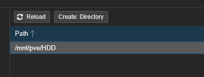
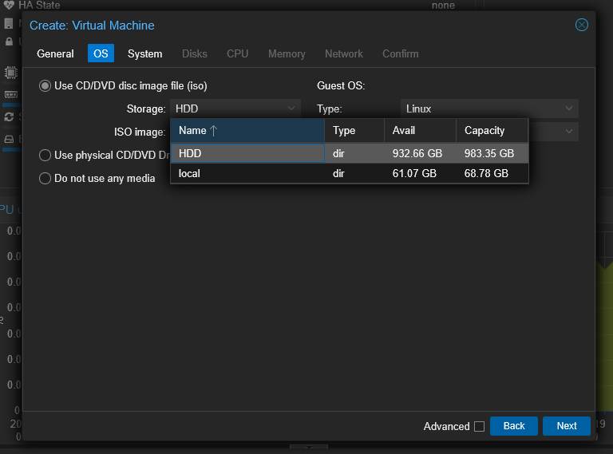

# Proxmox'a Yeni Disk Ekleme

1. Disk sunucuya takildiktan sonra proxmox'un arayuzune girilir.
2. **Datacenter** menusunden yeni eklenen disk secilerek (dev/sdb) Wipe Disk secenegine tiklanir ve disk temizlenir. (Bu islemden sonra diskinizdeki veriler kaybolacaktır. Bu islemden once yedekleme yapmaniz gerekiyorsa mutlaka yapmalisiniz.)

3. **Disks** menusunden **Directory** kismina tiklayarak **Create Directory** secenegi ile yeni disk bir isim ile makineye mount edilir.

4. Yeni bir sanal makine veya LXC containeri olusturulurken bu diskin kullanilabilir oldugu dogrulanir.

