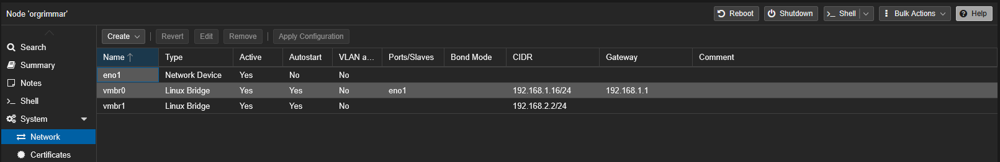

# Proxmox'da Yeni bir Subnet Oluşturma

- Aşağıdaki şekilde vaya isteğe göre bir bridge oluşturulur ve Apply Config butonuna basılır.


Eklendikten sonra Host Makinenin(proxmox) network ayarlari bu sekilde gozukecektir.




- İstenilen sanal sunucular bu networke dahil edilir.


## Olusturulan Networkung Internete Erisimi

- Host makineye gerekli iptables ayarlari girilir.

```
iptables  -t nat -A POSTROUTING -o vmbr0 -j MASQUERADE
iptables -A FORWARD -i vmbr1 -o eth0 -j ACCEPT
iptables -A FORWARD -i eth0 -o vmbr1 -m state --state RELATED,ESTABLISHED -j ACCEPT
```

Istege gore ```iptables-save /etc/iptables/rules.v4``` komutu ile kurallar dosyaya kaydedilir.

- Ana makinede(proxmox) Ip forwarding kapali ise aktif hale getirilir.

```
echo "net.ipv4.ip_forward=1" | tee -a /etc/sysctl.conf
```

Asagidaki komut ile ayar kontrol edilir, ciktisi 1 olmali.

```
sysctl -p
```